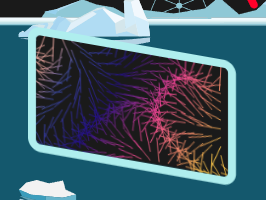
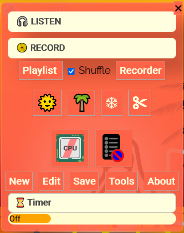
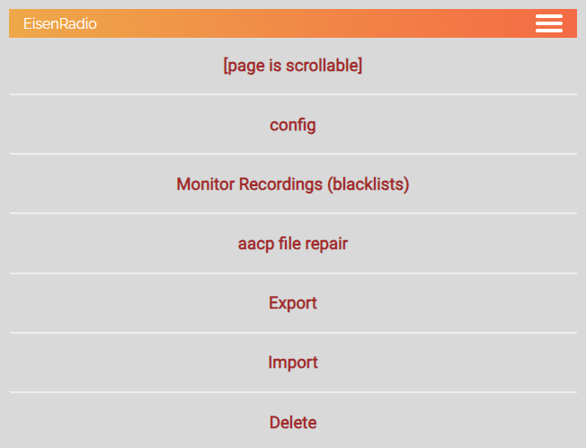

.. role::  raw-html(raw)
    :format: html

Eisenradio - Web radio DB / Media-player
========================================

.. image:: https://github\.com/44xtc44/EisenRadio/raw/dev/docs/source/aircraft_logo\.png
          :target: https://github\.com/44xtc44/EisenRadio/raw/dev/docs/source/aircraft_logo\.png
          :alt: logo of eisenradio

.. image:: https://github\.com/44xtc44/eisenradio/actions/workflows/tests\.yml/badge.svg?branch=dev
          :target: https://github\.com/44xtc44/eisenradio/actions/workflows/tests\.yml/badge.svg?branch=dev
          :alt: Tests

Overview
--------
This repository shows the full stack source code of an SVG animated GUI for `GhettoRecorder <https://github.com/44xtc44/GhettoRecorder>`_.

* first internet Radio App that can run a Spectrum Analyser in a Browser (Feb,2022), sketch at page bottom
* SVG animations in vanilla JavaScript super fast animated and colorized with regex
* Playlist feature; load and walk through a list of your local sound files
* REST API Flask endpoints; serve a SQLite database in plain SQL
* deployment source code for `Android Studio <https://github.com/44xtc44/EisenRadio-chaquopy>`_ , `Docker <https://github.com/44xtc44/EisenRadio/blob/dev/Dockerfile>`_, `Snapcraft <https://github.com/44xtc44/EisenRadio/tree/dev/snap>`_, `Kivy <https://github.com/44xtc44/EisenRadio/tree/dev/kivy>`_ available

Name
----
The initial design was intended to mimic a hardware store site with multiple items listed.
"Eisen" Hardware [iron radios].

Comic style animated internet radio
-----------------------------------
Inkscape created SVG images are used everywhere in the app. No raster graphics in this project. Except converted from SVG.

* 90% of the SVG animations run on canvas for reduced CPU load and smooth, up-scaled display
* a dedicated multi SVG image and SVG group loader class to preload all SVG stuff as super correct tagged SVG images
* inline SVG groups are loaded into a dictionary of image instances and connected to their canvas

-

-

* each instance stores the image, a list of its SVG tags as well as the current transformation status and position, ...
* SVG path manipulation method with regex

The functional principle can be transferred to Java on Android to create dynamic 2D game backgrounds.

Audio
------
Audio spectrum is used to animate the colors of the speaker symbol waves.
Speaker symbol shows customized colors for different levels of audio output strength and dynamic.
Unfortunately the display is very CPU hungry. So only one speaker is shown.

Classic and Ambient :raw-html:`&#128998;`:raw-html:`&#129001;` music will often show other colors than Thrash Metal or Hip Hop :raw-html:`&#128999;`:raw-html:`&#128997;`.

Master function `getAverageVolume() <https://github.com/44xtc44/EisenRadio/blob/dev/eisenradio/eisenhome/bp_home_static/js/svg-manage.js#L1760>`_
calculates the audio volume level. This function was created by "franks laboratory", link in the Thank You section at bottom.

The "scaling by rhythm" of frontman Tux and friends :raw-html:`&#128039; &#128049; &#128059;` is also driven by `getAverageVolume() <https://github.com/44xtc44/EisenRadio/blob/dev/eisenradio/eisenhome/bp_home_static/js/svg-manage.js#L1760>`_

Local audio and shuffled playlists
-----------------------------------
A local folder with files of different sound file types is called a playlist.
AAC and MP3 files are known to run. You can go back and forth in the list.

If AAC is hanging, you can repair the whole folder with "Tools/aacp file repair" menu.
Integrated from my `aacRepair <https://github.com/44xtc44/aacRepair>`_ repo.

Remember, the app runs in a browser.
We *misuse* the upload multi select feature of the browser.
Nothing is uploaded, but file *objects* are caught in a list and played.

Gain - preamp
--------------
Bring your earbuds to the limit.
EisenRadio owns a *Volume Gain* slider (as well as `GhettoRecorder <https://github.com/44xtc44/GhettoRecorder>`_).
Push the preamp to 300%. This feels like 20% louder.

Works with bluetooth headphones! :raw-html:`&#127911;`

Spectrum Analyzer
------------------

Spectrum analyzer canvas is now fully integrated and can be switched by the "TV" button.
Choose between different spectrum analyzer shows.

This concept can show its strengths if used to present the latest management reports.
A background video on canvas one and several statistics shown on separated, animated, or distorted monitors, canvas of course.

|pic1| samples |pic2|

Customized radio
-----------------
"Edit" the radio settings. Upload your favorite pictures to the database. Add a comment.

The app page is separated by two areas.
A monitor to the left and a display area beside for pictures and comments or the playlist titles.

Energy Saver
-------------
Sustainable fun reduction.
Some exotic browser and mobiles could be overwhelmed by the fully animated show.

You are compensated by a CPU icon that can change its color.

Recorder
---------
Called and terminated GhettoRecorder threads for listen and record.

This version suffers from the initial button press concept.
Next version of EisenRadio will use the latest GhettoRecorder for easy-peasy internal switching.

Recorder blacklist feature
---------------------------
Each recorder refuses to write a file, if the title was written to its radio specific blacklist before.

One dedicated thread is responsible to update all radio blacklists.
All lists can be dumped into a JSON file and merged with GhettoRecorder blacklists. Uploaded to DB then.

EisenRadio writes temporary lists of known recorded file names in JSON format.
The SQLite database is updated with a fresh file name only if a recorder writes a new file.
An internet cloud connection count in mind.

:raw-html:`&#9776;` Multiple tools menu
----------------------------------------

* feature selection to switch animation on/off
* enable and maintain recorder blacklists with file names
* dump the radio or blacklist database table entries as a JSON file
* import a GhettoRecorder `settings.ini <https://github.com/44xtc44/GhettoRecorder/blob/dev/ghettorecorder/settings.ini>`_ file to database to add more radio station URLs

|picTool| |picConfig| |picBlack|

Help
-----
Use the menu bar. *About* offers a help menu.

There is a "post-it", how to reveal the URL of your beloved radio station, hidden in an advertisement polluted website.

Links
-----

The app is available as

* Android Studio source code `GitHub EisenRadio-chaquopy <https://github.com/44xtc44/EisenRadio-chaquopy>`_,
* Kivy Android source code `GitHub EisenRadio <https://github.com/44xtc44/EisenRadio/tree/dev/android/>`_ and `PYPI - APK debug build <https://pypi.org/project/eisenradio-apk/>`_
* SNAP `eisenradio <https://snapcraft.io/eisenradio>`_ and `PYPI package <https://pypi.org/project/eisenradio/>`_.

Command line
------------

EisenRadio GUI supported by Flask server.::

    $ eisenradio  # executable script in Python Path
    $ python3 -m eisenradio.gui  # runs package if Python path is defective or the SNAP pkg installer knows eisenradio

You can change the folder via the menu options

Export / Import of GhettoRecorder in- and output files
-------------------------------------------------------

Eisenradio stores *radio names and URLs* and *blacklists* in its database.

You can export for GhettoRecorder ``settings.ini`` and ``blacklist.json`` from database.
``Tools/Export/Names and URLs`` menu.

GhettoRecorder created ``blacklist.json`` can be imported into your database.

Eisenradio - the boring details
-------------------------------

* REST API app on blueprints and ApplicationFactory of the Flask microframework with a SQLite database
* First Internet Radio App that can run a Spectrum Analyser in a Web browser (Feb,2022)
* A local Python Flask Web Server connects to the radio server in behalf of you. Your browser connects to Flask

  * Backend (server) opens the connection, buffers the radio stream and presents it to localhost IP: 127.0.0.1
  * Frontend (browser) controls the backend, plays internet and local audio playlists
  * Browser audio element connects `http://localhost:5050/sound/classic` that streams `http://37.251.146.169:8000/streamHD`
  * Closing the browser does not disconnect the server listen (buffer discarded) nor streaming connections

* Plays and repairs aac plus files; play (1.3), repairs since version (1.4);
* Backup and restore are easy work with the help of an optional ex/imported human-readable *ini* file
* Blacklist feature for recorded files (titles); delete only once
  * lists can be ex/imported via a json dictionary file to other devices
* playing local audio uses the web server multiple file upload feature
* Multithreading allows you an unlimited number of radio connections at the same time, until the ISP Bandwidth limit hits
* Android APK Package uses Python Kivy for multi-touch and promotes the app to "foreground service" (to not get killed)

::

         """ sketch """

         |B |               |S | Flask web server, Header[Werkzeug/2.0.2 Python/3.10.1]
         |r |listen         |e |-------> starRadio
         |o |------->   <-- |r |
         |w |GhettoRecorder |v |-------> planetRadio
         |s |--->    <----- |e |
         |e |               |r |-------> satelliteRadio
         |r |               |  |
         net: localhost     net: internet
         CORS: accept       CORS: deny
         audioNode: 1,-1    audioNode: 0, 0
         JavaScript,CSS     Python,SQL

    Cross-Origin Resource Sharing mechanism (CORS)
    i.a. prevents a Browser from analysing audio from internet

pip install
-----------

::

    $ pip3 install eisenradio  # Tux
    > pip install eisenradio  # M$

Pytest and tox
--------------
Part of the test automation with flake8 and tox on GitHub

::

    $ tox

Uninstall
---------
Python user:

::

    find the module location
    uninstall and then remove remnants

    $ pip3 show eisenradio

    $ pip3 uninstall eisenradio

    Location: ... /python310/site-packages

Sphinx Documentation
--------------------
`eisenradio.readthedocs.io <https://eisenradio.readthedocs.io/en/latest/>`_

Contributions
-------------

Pull requests are welcome.
If you want to make a major change, open an issue at first.

Known issues
------------
Detected problems got a "todo" marker.
You can search through the project to see what is going wrong.

Thank you
---------
`YouTube franks laboratory <https://www.youtube.com/results?search_query=franks+laboratory>`_

License
-------
MIT